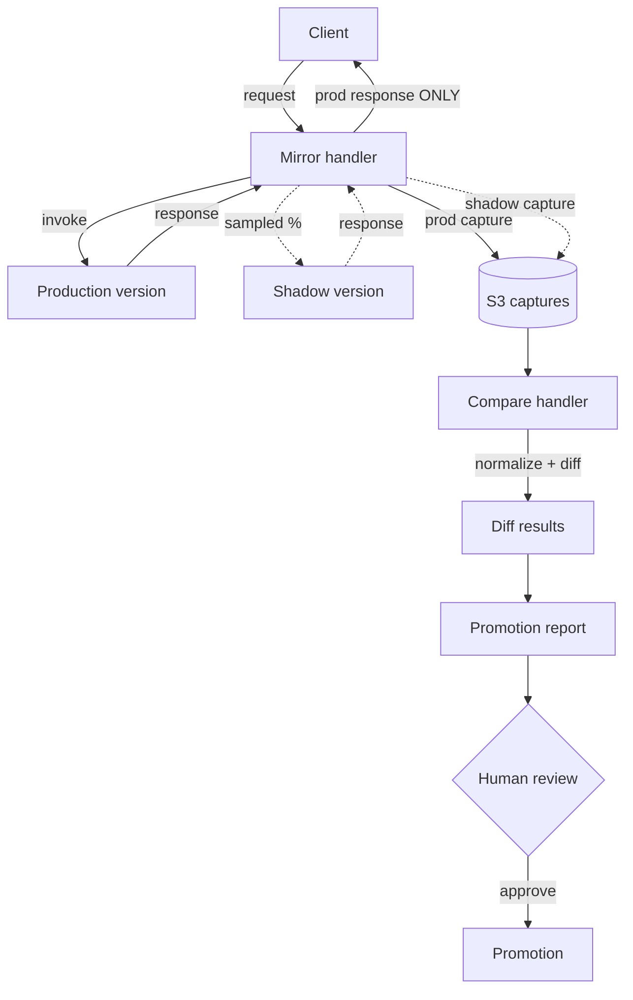

# Architecture

ShadowDeploy has two runtime paths: an **inline mirror** that runs in the
request path, and an **out-of-band comparison** that runs on captured data.
Separating them keeps the request path fast and keeps the discard guarantee
simple to reason about.

## Data flow

The dotted lines are the shadow path. Notice the client edge comes **only** from
the production response; the shadow response never has an edge to the client.

## The shadow-discard guarantee

In `handlers/mirror.py` the client response is bound to the production result
*before* the shadow target is ever invoked:

1. `prod_invoke(event)` runs and its result is captured.
2. `client_response = prod_result` — locked in.
3. Only then, if sampling selects the request, `shadow_invoke` runs inside a
   `try/except` whose result is captured and returned **on the outcome object**,
   never substituted into `client_response`.

Because the assignment happens first and is never reassigned, no shadow code
path can change what the client receives. The functional test
`test_client_always_gets_prod_response_even_when_shadow_differs` asserts this
with a shadow that returns a deliberately different body.

## Error isolation

The shadow invocation is wrapped so any exception is swallowed and logged as a
`shadow_error` record. The client path has already returned by then. Test:
`test_shadow_error_is_isolated_from_client`.

## Normalization before diffing

Raw prod/shadow bodies contain non-deterministic fields (timestamps, request
ids). `core/normalize.py` replaces these with a stable placeholder and drops
caller-listed ignore fields, so the diff in `core/diff.py` reports only
meaningful divergence. Without this step every comparison would be a false
positive — the reviewer's "everything flagged as a diff" failure mode.

## Components

| Module | Responsibility |
|---|---|
| `core/models.py` | Typed domain models (config, captures, diffs, verdict). |
| `core/config.py` | Validation + bounds (sampling cap, retention). |
| `core/sampling.py` | Deterministic, correlation-id-keyed sampling. |
| `core/correlation.py` | Correlation id generation/propagation. |
| `core/capture.py` | Build a capture record with PII masked. |
| `core/pii.py` | PII masking patterns + named-field masking. |
| `core/normalize.py` | Strip non-deterministic fields. |
| `core/diff.py` | Recursive structural diff, categorized. |
| `core/metrics.py` | Aggregate match %, latency/error deltas. |
| `core/cost.py` | Cost estimate, budget check, kill-switch. |
| `handlers/mirror.py` | Inline mirror + discard guarantee + error isolation. |
| `handlers/compare_handler.py` | Pair + normalize + diff a batch. |
| `reporting/report.py` | Promotion verdict logic. |
| `reporting/render.py` | JSON + Markdown rendering. |
| `iac/*` | Terraform + CDK emitters. |
| `orchestrator.py` | In-process end-to-end pipeline. |
| `cli.py` | Command-line interface. |

## AWS service responsibilities

| Service | Role in the harness |
|---|---|
| ALB / API Gateway | Entry point; traffic mirroring to the shadow target. |
| Lambda / ECS | Mirror handler, shadow target, comparison handler. |
| S3 | Stores prod and shadow captures (lifecycle-expired). |
| Athena | Queries captures for diffing at scale. |
| CloudWatch | Shadow error rate + divergence dashboard and alarms. |
| Bedrock (optional) | Semantic diff summaries for ML outputs. |
| AWS Budgets / CloudWatch billing | $10/$50/$100 cost alarms. |
